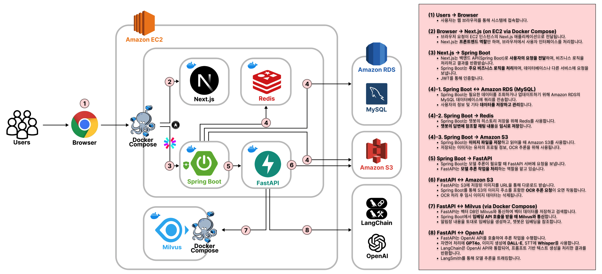

# 몽글몽글: 우리 아이 일상 기록 앱

<!-- ###  DIBIDIBIDEEP -->
<!-- 사이트 링크 -->
<!-- ### [mongeul.com](https://mongeul.com) -->
<!--   -->
<!-- pdf -->
<!-- [발표자료 PDF](images/몽글몽글.pdf) -->
<!-- pdf title -->

## 프로젝트 소개
- 아이의 일상을 관리하고, 소중한 순간을 따뜻한 이야기로 기록하는 육아 지원 서비스입니다.
- 가정통신문으로부터 준비물, 행사 등 잊기쉬운 일정을 OCR을 통해 추출하여 캘린더에 기록합니다.
- LLM을 이용하여 아이의 하루를 요약하고, 키워드 바탕으로 맞춤형 동화를 생성합니다. 
- 챗봇을 통해 아이와의 특별한 순간을 기록하고, 일기 작성을 도와줍니다.

## 프로젝트 정보

- **팀명**: DIBIDIBIDEEP
- **진행 기간**: 2024.08.21 - 2024.10.14 (약 2개월)
- **웹사이트**: https://mongeul.com

<!-- | 분류             | 설명                     |
|------------------|--------------------------|
| 운영체제         | Windows 10 / Ubuntu(AWS) |
| 버전 관리 시스템 | Git, Github              |
| 개발 도구        | Sublime Text3            |
| 개발 언어 및 프레임워크 | 1. Python 3  
  - Flask & extended module  
  - Requests  
  - BeautifulSoup  
  - Mysqldb  
  2. HTML & CSS  
  - Bootstrap  
  3. Javascript  
  - JQuery  
  4. SQL - (MySQL) |
| 데이터베이스     | MySQL 5.7.25 (64bit)     |
| 웹 서버 환경     | uwsgi + nginx            | -->

<!-- ## 👩🏻‍💻 Members -->
## 팀원 구성

<table align="center">
    <tr>
        <td align="center">윤수빈</td>
        <td align="center">최은아</td>
        <td align="center">조은성</td>
        <td align="center">정현수</td>
        <td align="center">김인수</td>
        <td align="center">옥창우</td>
    </tr>
    <tr height="160px">
        <td align="center">
            
        </td>
        <td align="center">
            
        </td>
        <td align="center">
            
        </td>
        <td align="center">
            
        </td>
        <td align="center">
            
        </td>        
        <td align="center">
            
        </td>
    </tr>
    <tr>
        <td align="center"><code>Full-Stack Engineer</code></td>
        <td align="center"><code>Front-End Engineer</code></td>
        <td align="center"><code>Back-End Engineer</code></td>
        <td align="center"><code>Back-End Engineer</code></td>
        <td align="center"><code>AI Engineer</code></td>
        <td align="center"><code>AI Engineer</code></td>
    </tr>
    <tr>
        <td align="center"><a href="https://github.com/nunu1101">Github</a></td>
        <td align="center"><a href="https://github.com/silver-or">Github</a></td>
        <td align="center"><a href="https://github.com/eunseongjo">Github</a></td>
        <td align="center"><a href="https://github.com/hyun987">Github</a></td>
        <td align="center"><a href="https://github.com/in-sukim">Github</a></td>
        <td align="center"><a href="https://github.com/okchang95">Github</a></td>
    </tr>
    <tr>
        <td align="left" >
          <li >PM</li> <li>UI/UX 디자인</li> <li>컴포넌트 개발</li>
        </td>
        <td align="left">
          <li>UI/UX 디자인</li> <li>컴포넌트 개발</li> <li>미들웨어 구현</li>
        </td>
        <td align="left">
          <li>Backend API 개발</li> <li>비즈니스 로직 설계</li> <li>DB 설계</li>
        </td>
        <td align="left">
          <li>Backend API 개발</li> <li>비즈니스 로직 설계</li> <li>DB 설계</li>
        </td>
        <td align="left">
          <li>AI 서비스 개발</li> <li>프롬프트 엔지니어링</li> <li>Docker 컨테이너화</li> <li>API 서버 개발</li> 
        </td>        
        <td align="left">
          <li>AWS 배포</li> <li>개발 환경 표준화</li> <li>Docker 컨테이너화</li> <li>모니터링 및 이슈파악</li>
        </td>
    </tr>
</table>

## 개발 환경

<table>
  <tr>
    <th>분류</th>
    <th>설명</th>
  </tr>
  <tr>
    <td>운영체제</td>
    <td>Windows 10 / Ubuntu 22.04 (WSL2, AWS)</td>
  </tr>
  <tr>
    <td>버전 관리 시스템</td>
    <td>Git, Github</td>
  </tr>
  <tr>
    <td>개발 도구</td>
    <td>VSCode, IntelliJ</td>
  </tr>
  <tr>
    <td>개발 언어 및 프레임워크</td>
    <td>
        <li>Frontend: <code>Next.js</code>, <code>TypeScript</code>, <code>Tailwind CSS</code></li>
        <li>Backend: <code>Java</code> (<code>Spring Boot</code>)</li>
        <li>Inference: <code>Python</code> (<code>FastAPI</code>, <code>Langchain</code>)</li>
        <li>SQL: <code>MySQL</code></li>
    </td>
  </tr>
    <tr>
    <td>추론 모델</td>
    <td>
        <li>OCR: BetterOCR (EasyOCR + PORORO)</li>
        <li>LLM: gpt-4o (OpenAI api)</li>
        <li>Image generation: DALL-E (OpenAI api)</li>
        <li>STT: Whisper (OpenAI api)</li>
    </td>
  </tr>
  <tr>
    <td>데이터베이스</td>
    <td>AWS RDS(MySQL 8.0.35)</td>
  </tr>
  <tr>
    <td>스토리지</td>
    <td>AWS S3</td>
  </tr>
  <tr>
    <td>웹 서버 환경</td>
    <td>AWS EC2 (서버 호스팅), ELB (로드 밸런싱), Route 53 (DNS 관리)</td>
  </tr>
</table>

## 아키텍처

## 참고자료
- 발표자료 PDF - [몽글몽글.pdf](images/몽글몽글.pdf)

